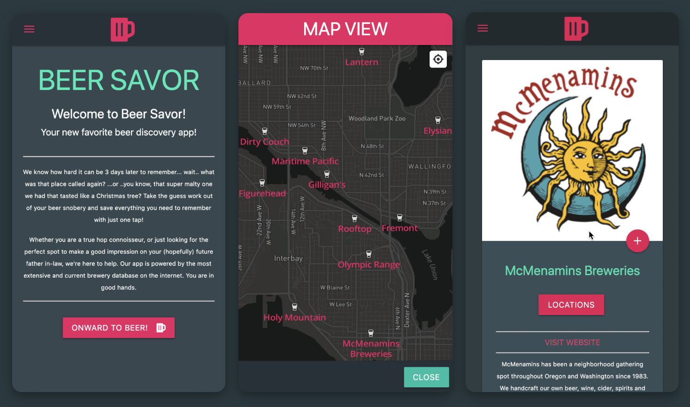

# Beer Savor

Beer Savor is a mobile web app designed to make it easy for users to find nearby breweries and keep track of the beers that they have enjoyed from said breweries. 

## Technologies Used

* Node.js
* Sequelize
* JavaScript
* JQuery
* HTML
* EJS
* CSS
* Materialize
* Cloudinary

## Where Does The Data Come From?

We use `brewerydb.com` APIs for all beer related content and `Mapbox` APIs for geocoding and map view. 

## What Is Being Stored?

Beer Savor saves information on users, breweries, and beers. The following schemas show exactly what is being stored.

### User Schema

| Column | Data Type | Description |
|--------|-----------|-------------|
| id | Integer | Primary Key |
| firstname | String | required field |
| lastname | String | - |
| email | String | usernameField for login - required field |
| password | String | hashed with BCrypt before creation of new row |
| birthdate | Date | Might want to use moment module to format this |
| admin | Boolean | Set default value to false |
| image | Text | A URL to an image of the user - required field |
| bio | Text | - |
| facebookId | String | Facebook Profile Id |
| facebookToken | String | Facebook Login Token |

### Brewery Schema

| Column | Data Type | Description |
|--------|-----------|-------------|
| id | Integer | Primary key |
| apiId | String | ID returned by the API | 
| name | String | - |
| established | String | returns a year from the API |
| imageUrl | String | - |
| long | Decimal | - |
| lat | Decimal | - |
| website | String | - |
| description | Text | - |
| isInBusiness | Boolean | API returns "Y" or "N" |
| status | String | "Verified" or not |
| userId | Integer | Foreign key from user table |

### Beer Schema

| Column | Data Type | Description |
|--------|-----------|-------------|
| id | Integer | Primary key |
| apiId | String | ID returned by the API | 
| name | String | - |
| style | String | Uses shortname from API |
| imageUrl | String | - |
| ibu | Decimal | Bitterness rating | 
| abv | Decimal | Alcohol percentage
| availability | String | - |
| breweryId | Integer | Foreign key from brewery table |
| userId | Integer | Foreign key from user table |

## Routes Used

| Method | Path | Location | Purpose |
|--------|------|----------|---------|
| GET | / | index.js | Home Page |

### Profile Routes

| Method | Path | Location | Purpose |
|--------|------|----------|---------|
| GET | /profile | controllers/profile.js | User Profile Page |
| GET | /profile/admin | controllers/profile.js | Admin Dashboard Page |
| PUT | /profile | controllers/profile.js | Allows user to edit bio |
| DELETE | /profile/beers | controllers/profile.js | Remove a specific beer from user saves |
| DELETE | /profile/breweries | controllers/profile.js | Remove a brewery and it's beers from saves |

### Authorization Routes

| Method | Path | Location | Purpose |
|--------|------|----------|---------|
| GET | /auth/login | controllers/auth.js | Renders Login Form |
| POST | /auth/login | controllers/auth.js | Handles Login Auth |
| GET | /auth/signup | controllers/auth.js | Renders Signup Form |
| POST | /auth/signup | controllers/auth.js | Handles New User Signup |
| GET | /auth/logout | controllers/auth.js | Removes User Session Data |
| GET | /auth/facebook | controllers/auth.js | Outgoing Request to Facebook |
| GET | /auth/callback/facebook | controllers/auth.js | Incoming Data from Facebook |

### Brewery Data Routes

| Method | Path | Location | Purpose |
|--------|------|----------|---------|
| GET | /breweries | controllers/breweries.js | Renders brewery search form |
| POST | /breweries/results | controllers/breweries.js | Displays search results - includes map view |
| GET | /breweries/:id | controllers/breweries.js | Shows info for a specific brewery |
| POST | /breweries/:id | controllers/breweries.js | Handles brewery and beer saving by user |

## Challenges In Development

#### Sifting through the APIs

While not necessarily difficult, one of the more time consuming tasks for this project was to sift through all of the API documentation provided by `brewerydb.com`. They have just about every spec of information that you could need for a brewery.. if you know where to look for it. Take the time to really get to know the structure of the information at your fingertips. This makes the development process flow much more naturally as you move forward. 

#### Mapbox is a bit of a nightmare

Want to know how to change a color? Here's an entire tutorial on how to build a map from scratch, add points, add zoom controls, and locate the user! But... how do I change a color? Oh, didn't you see the code for that nested in the forEach loop under the add points section of the tutorial? NO?? Come on, it's all right there!

I think you get the idea. There is almost no such thing as a reference doc. There are, however, piles and piles of tutorials that may have what you need nested somewhere inside of it. Also, you can't make a marker a link without nesting it in a popup. That is not intuitive.

